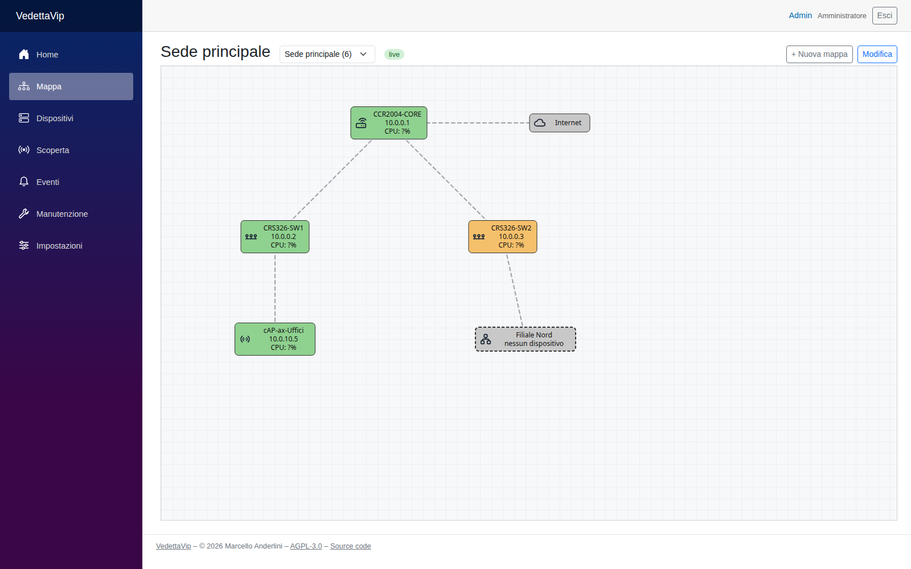

# VedettaVip

*[Leggi in italiano](README.it.md)*

VedettaVip is a network monitoring system built around a **live topology map**, inspired by MikroTik The Dude:
nodes coloured by state, links showing live traffic, submaps, and drag & drop configuration. It integrates deeply with
MikroTik RouterOS (API, neighbours, resources, WireGuard peers) and monitors any device via ICMP and SNMP.

It does not try to replace general-purpose tools such as Zabbix or LibreNMS: the focus is a map that is pleasant to
look at on a NOC screen and quick to set up.



*The screenshot shows only the demo data created by the first database migration.*

> The user interface and the log messages are currently in **Italian**.

## Features

- **Topology map** (hand-written SVG, Blazor WebAssembly): Up green, Partial orange, Down red, Unknown grey; label
  templates with live values (`[Name]`, `[Address]`, `[Cpu]`, `[Temp]`, `[Uptime]`…); links drawn as tx/rx halves,
  coloured and sized by utilisation; snap to grid, pan, zoom; view-only mode for NOC screens and edit mode (add nodes
  with right click, draw links by dragging).
- **Submaps** with aggregated state (worst state of all descendants, updated live) and a summary badge.
- **Polling agent** (separate process, no database access): ICMP with hysteresis, SNMP v1/v2c, interface traffic from
  64-bit counters (32-bit fallback for devices without `ifXTable`), interface inventory, configurable thresholds.
- **RouterOS**: classic API (`api`/`api-ssl`, v6 and v7) for CPU, memory, temperature, voltage, uptime, version;
  watched interfaces and WireGuard peers; CPU and temperature thresholds.
- **Discovery**: neighbours (RouterOS `/ip/neighbor`, LLDP-MIB, CDP-MIB), ARP tables with DHCP leases, subnet scans
  (ping, DNS, SNMP, TCP ports), vendor from MAC address (IEEE OUI); proposals to confirm, never added automatically.
- **Metrics** on TimescaleDB (raw 7 days, 5-minute aggregates 90 days, hourly aggregates 2 years) with traffic,
  latency/loss and RouterOS charts.
- **Notifications** by email (SMTP) and Telegram: recipients by customer, map or global; parent/child dependencies
  to avoid alert storms; flap suppression; maintenance windows (one-off and weekly); reminders; acknowledgement.
- **Users and roles** (Admin, Operator, Viewer), local accounts, CSRF protection, secrets encrypted with ASP.NET Core
  Data Protection.
- **Device management**: overview page with filters, CSV import/export.

## Quick start (Docker Compose)

Requirements: a Linux host with Docker Engine and the Compose plugin.

```bash
git clone https://github.com/dummy1969/vedettavip.git
cd vedettavip
cp deploy/.env.example deploy/.env
chmod 600 deploy/.env
```

Edit `deploy/.env`:

- `VEDETTAVIP_HOST`: the IP address or DNS name you will use to open VedettaVip (`localhost` for a test on the same
  machine);
- `POSTGRES_PASSWORD` and `AGENT_API_KEY`: replace the example values, e.g. with `openssl rand -hex 24` and
  `openssl rand -base64 36`.

Then:

```bash
docker compose -f deploy/docker-compose.yml up -d --build
# setup code for the first administrator, written to the API log
docker compose -f deploy/docker-compose.yml logs api | grep "Codice di setup"
```

Open `https://<VEDETTAVIP_HOST>`, accept the certificate (issued by Caddy's internal CA: import its root to avoid
the warning, see [deploy/production/README.md](deploy/production/README.md)) and create the administrator with the
setup code. The first map contains demo devices with fictitious addresses: replace them with your own on the
**Dispositivi** (devices) page.

For a production server (deploy over SSH, nightly backups, restore, NAS copy) see
[deploy/production/README.md](deploy/production/README.md).

## Configuration

All installation-specific values come from outside the repository; nothing in the code needs to be edited.

| Where | What |
|---|---|
| `deploy/.env` (from `deploy/.env.example`) | host name, ports (`HTTP_PORT`, `HTTPS_PORT`), database credentials, agent key, agent name, fallback SNMP community, time zone, `APP_SOURCE_URL`, backup settings |
| `docker-compose.override.yml` | anything else in the stack: volume names, extra mounts, resource limits |
| `appsettings.Local.json`, `appsettings.{Environment}.Local.json` | .NET settings of the API, Worker or Web, next to their `appsettings.json` (loaded after it, before environment variables) |
| Web UI → Impostazioni (settings) | SNMP and RouterOS credential profiles, detection and metric thresholds, SMTP, Telegram, contacts, customers, users |

These files are ignored by Git (`.gitignore`) and by the Docker build context (`.dockerignore`). A typical layout
keeps them in a separate private repository and applies them on top of the public code:

```bash
docker compose -f <vedettavip>/deploy/docker-compose.yml -f docker-compose.override.yml --env-file .env up -d --build
```

Relative paths in the override resolve from `<vedettavip>/deploy`. Main settings:

| Variable | Default | Notes |
|---|---|---|
| `VEDETTAVIP_HOST` | – (required) | used by Caddy for the HTTPS certificate |
| `POSTGRES_USER`, `POSTGRES_DB`, `POSTGRES_PASSWORD` | `netmap`, `netmap`, – | applied only when the database volume is created |
| `AGENT_API_KEY` | – (required, ≥ 32 characters) | shared between the API and the polling agents (`X-Agent-Key`) |
| `AGENT_ID` | `vedettavip-server` | name of the agent running in the stack |
| `SNMP_COMMUNITY` | `public` | fallback when no SNMP profile is configured in the UI |
| `APP_SOURCE_URL` | official repository | "Source code" link of the web interface (see License) |
| `TZ` | `Europe/Rome` | |

Credentials stored from the UI (SNMP communities, RouterOS passwords, SMTP password, Telegram token) are encrypted
with ASP.NET Core Data Protection; the keys are stored in the database, so **treat database backups as secrets**.

## Architecture

```
Browser (Blazor WebAssembly: map, dashboard) ◄── SignalR / REST ──► VedettaVip.Api ──► PostgreSQL + TimescaleDB
                                                                        ▲
                                                     HTTPS (X-Agent-Key) │ SignalR /hubs/agent
                                                                        │
                                                   VedettaVip.Worker (polling agent: ICMP, SNMP,
                                                   RouterOS API, discovery, subnet scans)
```

| Project | Role |
|---|---|
| `VedettaVip.Api` | ASP.NET Core minimal API, SignalR hubs, EF Core (Npgsql), notifications, thresholds, discovery planner |
| `VedettaVip.Worker` | polling agent; talks to the API only over HTTP, never to the database (ready to become a remote agent) |
| `VedettaVip.Web` / `VedettaVip.Web.Client` | Blazor Web App host and WebAssembly components (map, pages) |
| `VedettaVip.Shared` | DTOs, enums, label templates shared by client and server |

Stack: .NET 10, ASP.NET Core, Blazor, SignalR, EF Core, PostgreSQL 17 + TimescaleDB, Lextm.SharpSnmpLib, MailKit,
Blazor-ApexCharts, Caddy. In Docker the Worker needs only the `NET_RAW` capability (ICMP).

## Roadmap

- Remote agents installed in customer networks, multi-tenant access per customer (MSP scenario)
- Two-factor authentication (TOTP) and external login (OIDC: Entra ID, Keycloak)
- Map backgrounds (floor plans, geographic maps) and force-directed auto-layout for discovered nodes
- Live propagation of map edits to other open browsers; links between different maps
- RouterOS: IPsec, PPP, EoIP/GRE, MNDP; SNMPv3
- Webhook notifications

## Contributing and security

See [CONTRIBUTING.md](CONTRIBUTING.md) (contributions require the DCO sign-off, `git commit -s`) and
[SECURITY.md](SECURITY.md) (report vulnerabilities privately, not in public issues).

## License

Copyright (C) 2026 Marcello Anderlini.

VedettaVip is free software, licensed under the **GNU Affero General Public License v3.0 or later**
([LICENSE](LICENSE)), with an additional term under section 7(b) ([NOTICE](NOTICE)).

In short (the license text prevails):

- you may use, study, modify and redistribute VedettaVip, also commercially;
- if you distribute it, modified or not, you must do so under the same license and provide the corresponding source
  code;
- if you **modify it and let users interact with it over a network** (for example as a hosted service), you must offer
  those users the source code of your modified version: set `APP_SOURCE_URL` to the location of your source;
- **attribution clause** (NOTICE, section 7(b)): modified versions must keep the attribution
  "VedettaVip – created by Marcello Anderlini" in the footer of the web interface and in the About page.

Third-party components and their licenses are listed in [THIRD-PARTY-NOTICES.md](THIRD-PARTY-NOTICES.md).

### Note on TimescaleDB

The Docker stack uses the official `timescale/timescaledb` image. VedettaVip relies on TimescaleDB features
(compression, retention policies, continuous aggregates) that are distributed under the **Timescale License (TSL)**,
which is not an open source license: it allows internal use and use as the backend of your own products and services,
but not offering TimescaleDB itself as a database service. TimescaleDB is a separate program, not part of VedettaVip;
whoever operates an installation must comply with its license. See
[THIRD-PARTY-NOTICES.md](THIRD-PARTY-NOTICES.md#timescaledb-and-the-timescale-license).

### Trademarks

VedettaVip is not affiliated with or endorsed by MikroTik. The Dude and RouterOS are trademarks of MikroTik.
